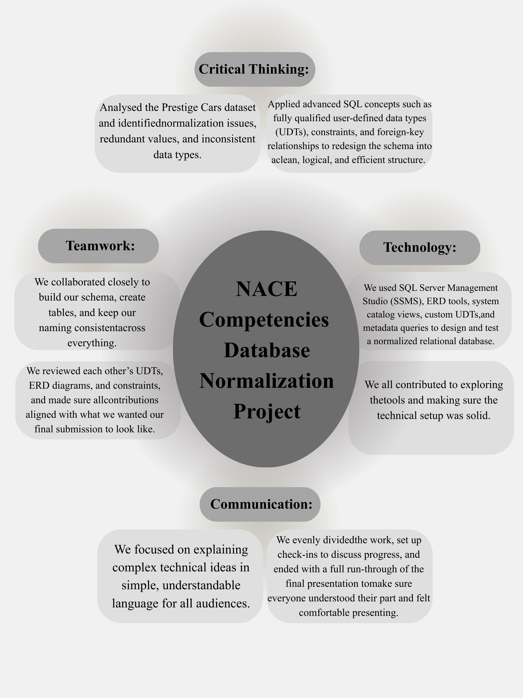

### Normalization Project

##  Goals
For this project, we were given a dataset from the Prestige Cars Database. The original database had tables with inconsistent data types, missing constraints, no enforced relationships, and no governance over how data should be structured. Our main objective was to redesign the database so it conforms with proper normalization rules. To do this, we created an example Schema, Fully Qualified Domains and applied them across tables that we custome created for that Schema. We then added constraints, default values, and foreign keys to ensure data consistency and referential integrity. Finally, we provided an ERD diagram of our tables to show a visual representation of our work. Overall, the project transforms a messy dataset into a structured and governed relational dataset.

##  Members
- **Azmain Abrar**
- **Shiwlee Rahman**
- **Christopher Vidal**
- **Eusan Mahatab**
- **Zarrin Cherry**
- **Haiyan Wei**

## Link To GROUP Discussion 

## To Do List

## GANT Chart

## NACE

## Tools & Technologies

| Tool | Purpose |
|------|----------|
| **Azure Data Studio** | SQL Query Execution & Notebooks |
| **DBeaver** | Query Testing, Schema Browsing |
| **GitHub** | Version Control, Submission |
| **YouTube** | Video Presentation Hosting |
